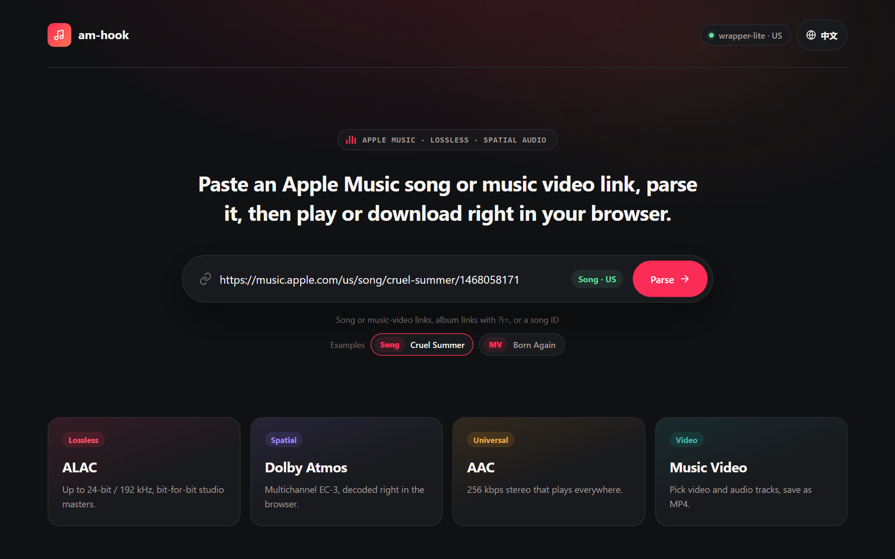

# am-hook

[中文](README.zh-CN.md) | English

An Apple Music decryption tool written in Rust, covering songs (FairPlay HLS) and music videos (PlayReady HLS).

By default **decryption happens entirely in the browser**. The server only talks to wrapper-lite (master playlists, decryption templates, licenses). The browser fetches media straight from Apple's CDN and decrypts it with WebAssembly in Web Workers, so no media traffic goes through the server. When external tools such as VLC or IDM need decrypted song URLs, start the server with `--hook` to enable the server-side decrypting proxy.



## Quick Start

```sh
cargo build --release

# Default: the browser decrypts; the server only serves playlists, templates and licenses
am-hook --listen 0.0.0.0:8888 --wrapper-url http://127.0.0.1:12340

# Also enable the server-side song decrypting proxy (for VLC / IDM; uses server bandwidth)
am-hook --listen 0.0.0.0:8888 --wrapper-url http://127.0.0.1:12340 --hook
```

Then open `http://127.0.0.1:8888/` and paste a link. Pages can also be opened directly by putting an Apple Music link after the server address:

| Input on the home page | Page opened |
|---|---|
| `https://music.apple.com/cn/song/<slug>/<id>` | `/https://music.apple.com/cn/song/<slug>/<id>` |
| `https://music.apple.com/cn/album/<slug>/<albumId>?i=<id>` | `/https://music.apple.com/cn/song/<slug>/<id>` |
| A numeric song ID, e.g. `1468058171` | `/https://music.apple.com/us/song/_/1468058171` |
| `https://music.apple.com/cn/music-video/<slug>/<id>` | `/https://music.apple.com/cn/music-video/<slug>/<id>` |

For example: `http://127.0.0.1:8888/https://music.apple.com/cn/music-video/super-bowl-lix-halftime-show-live/1836358807`. The country code in the link selects the storefront used for metadata.

### Requirements

- Rust 2021 edition toolchain
- A running wrapper-lite key server (default `http://127.0.0.1:12340`)
- A modern browser with Web Workers and WebAssembly. Playback uses MediaSource (EC-3 PCM fallback uses Web Audio); MV downloads need OPFS.

> OPFS is only available in a secure context: HTTPS, or `localhost` / `127.0.0.1`. Over `http://<LAN IP>`, song downloads fall back to in-memory Blobs (large files use more RAM) and MV downloads are unavailable. Playback is unaffected.

## Web UI

- Chinese and English UI; the top-right button switches instantly (remembered; the first visit follows the browser language). Playback and downloads in progress are not interrupted.
- The home page shows wrapper-lite status and recently opened songs and MVs.

### Songs

- Every variant is parsed automatically (lossless ALAC, Dolby Atmos, AAC, HE-AAC, including binaural and downmix versions), with artwork and track info fetched by the browser from the iTunes Lookup API.
- Each variant has a "more" menu:
  - **Download decrypted file**: decrypted in the browser, with progress and a cancel button.
  - `--hook` only: download through the server; an **external players** grid (14 players including VLC, PotPlayer, mpv, IINA, Infuse, nPlayer and MX Player, using the same link schemes as OpenList) that plays any variant from the server-decrypted media m3u8, current-platform players first; and **Copy URL**, as M3U8 (for players) or media file (for download managers such as IDM). Players must be installed and register their link scheme; desktop VLC, for example, registers no `vlc://` handler by default.
  - The "External player" button at the top opens the player grid for the highest quality.
- Built-in player: MSE with browser-side decryption. ALAC plays losslessly via FLAC-in-MP4 when the browser lacks ALAC support. EC-3 falls back to multichannel PCM when MSE is unavailable, with a notice about the spatial-audio limitation. Downloads keep the original codec. In `--hook` mode, other codecs may use native HLS or a direct media file. Space, arrow keys and system media controls are supported.
- Lyrics: when a song has lyrics, a Lyrics button appears on the player bar. The view comes from am-ttml: word- and line-synced highlighting, background vocals, duets, translation and pronunciation, instrumental dots, and click-to-seek. Its moving background is generated from the artwork. Esc closes it.

### Music Videos

- Video and audio tracks appear in separate columns. The highest bitrate video and its group's default audio are selected; changing the video updates the recommended audio, and audio can also be chosen manually.
- Playback uses MediaSource with seeking and bounded buffering. Unsupported codecs remain downloadable; pick AVC/AAC for broader playback compatibility.
- Independent CEA-608 caption tracks are decoded into native browser text tracks. The first one is shown by default; use the video's subtitle menu to switch or disable captions.
- Downloads stream decrypted, interleaved fragments to OPFS without holding the whole MV in memory, producing fragmented MP4 (no defragmentation, transcoding or tag writing). Completion triggers a save and exposes a "Save MP4" link. Cancellation and failure remove partial files; leaving the page attempts to remove the finished temporary file. A browser crash may leave files in site storage.

## How It Works

### Songs: browser-side decryption (default)

In the browser (`src/ui/decrypt.js`):

1. The media m3u8 is fetched directly from `aod.itunes.apple.com` (the CDN allows CORS and Range requests) and parsed into the init segment, fragment byte ranges and the key used by each fragment.
2. The first fragment uses the fixed template embedded in the wasm (`skd://itunes.apple.com/P000000000/s1/e1`); the rest use the track template from `/key`.
3. Fragments are fetched with Range requests and decrypted in place by a Worker pool (one `hook.wasm` instance per Worker). The decryption code is shared with the server (`crates/am-mp4`), so the output is byte-identical to `--hook` mode.
4. **Playback**: decrypted fragments feed MSE when the original codec is supported. If ALAC is unavailable but FLAC-in-MP4 is, the on-demand `flac.wasm` losslessly converts ALAC packets to FLAC frames and remuxes them into small fMP4 fragments. EC-3 uses MSE when supported, otherwise the on-demand `ec3.wasm` decoder plays 5.1/7.1 PCM through Web Audio (no Atmos object rendering). Seeking jumps to the matching source fragment.
5. **Download**: 4 lanes fetch and decrypt concurrently and write each result at its original offset into an OPFS temporary file, which is handed to the browser to save. Without OPFS it falls back to in-memory Blobs.

Both browser `hook.wasm` and server `--hook` repair identifiable ALAC end-tag damage after decryption (for example, song `1691044818`). The init segment's track and sample description identify complete uncompressed mono/stereo packets; a missing or damaged 3-bit `TYPE_END` is restored to `111`. PCM, sample lengths and Range offsets stay unchanged. Compressed packets, truncated PCM and packets without room for the tag are left untouched; FLAC transcoding keeps its fallback that can append a missing tag byte.

### Songs: server-side decrypting proxy (`--hook`)

With `--hook`, the server also serves proxy URLs (they return 404 otherwise):

```
http://<host>:8888/https://aod.itunes.apple.com/itunes-assets/...
```

This is a **URL-prefix proxy** (like cors-anywhere): the client appends the CDN URL to am-hook's address, and am-hook fetches, decrypts and returns it. It is a plain HTTP URL, not a proxy that has to be configured in the OS or player, so it can be handed directly to VLC, IDM and similar tools.

Only URLs containing `aod.itunes.apple.com/itunes-assets/` are handled, classified by filename:

| Type | Filename pattern | Behavior |
|---|---|---|
| Master m3u8 | `P<digits>_<not-A-start>.m3u8` | Forwarded unchanged |
| Media m3u8 | `P<digits>_A<digits>_...m3u8` | Metadata extracted, `#EXT-X-KEY` lines stripped. By default rewritten to a generic playlist (`EXT-X-VERSION:3`, no `EXT-X-MAP` / `EXT-X-BYTERANGE`, one URL per segment) for players with weak fMP4 byte-range support such as PotPlayer; append `?hook=byterange` to keep Apple's original layout |
| Media file | Media m3u8 name with `.m3u8` replaced by `_m.mp4` | Fragment bytes fetched by range, samples decrypted in place, metadata boxes neutralized, streamed back |
| Media segment | Media file name with `_m.mp4` replaced by `_m_seg<N>.mp4` | Init segment + fragment N, independently decodable (Range supported) |

Flow:

1. A media m3u8 request builds a track context with `adamId`, `skd://` URI, `fileuri`, the first fragment range, and all fragment byte ranges.
2. A background monitor fetches the track decryption template from wrapper-lite as soon as the context is complete.
3. Media file requests map HTTP ranges onto fragments and fetch only the needed bytes. Up to `--prefetch` fragments are downloaded concurrently and decrypted in parallel on temari's worker pool (off the async runtime), then streamed in order. Concurrent requests for the same fragment share one download/decrypt; results go into a byte-bounded LRU cache. Pending work is cancelled when the client disconnects.

Box handling shared by both modes: FairPlay metadata boxes (`sinf`, `senc`, `saiz`, `saio`, `pssh`, and `sgpd`/`sbgp` with grouping type `seig`/`seam`) are replaced with equal-length `free` boxes, so byte lengths and Range offsets stay exact. The `enca` box in the init segment is rewritten to the original codec (`ec-3`, `mp4a`, `alac`, etc.).

### Music videos

- `/parse/mv/<adamId>` gets the master URL from wrapper-lite `/webplayback`, fetches it with `User-Agent: AM`, and returns the playlist text and final CDN URL.
- `/mv/webplayback/<adamId>` and `/mv/license` relay to wrapper-lite `/webplayback` and `/license` (PlayReady only; license errors are shown without falling back to another DRM).
- Metadata (iTunes Lookup), track playlists and media segments are fetched by the browser directly from Apple.
- Challenge building, license parsing, CENC/CBCS decryption and fragmented MP4 muxing run in a Worker with `mv-core.wasm` (Go, see [browser/mvcore](browser/mvcore/README.md)). `--hook` does not proxy MV resources.
- Live playlists, discontinuities and changing initialization segments are not supported.

## Server Endpoints

| Endpoint | Description |
|---|---|
| `GET /` | Home page |
| `GET /https://music.apple.com/<cc>/song/<slug>/<id>` | Song page |
| `GET /https://music.apple.com/<cc>/music-video/<slug>/<id>` | MV page |
| `GET /status` | wrapper-lite status and available regions |
| `GET /parse/song/<adamId>` | Song master m3u8 via wrapper-lite, returned as variants |
| `GET /key?adamId=<adamId>&uri=<skd-uri>` | Song track decryption template JSON from wrapper-lite `/key` |
| `GET /lyrics/<adamId>` | TTML lyrics from wrapper-lite `/lyrics`, XML unchanged; 404 when the song has none |
| `GET /parse/mv/<adamId>` | MV master playlist text and final CDN URL |
| `GET /mv/webplayback/<adamId>`, `POST /mv/license` | MV relays to wrapper-lite `/webplayback` and `/license` |
| `/assets/...` | Pages, scripts and on-demand WASM modules embedded in the binary (`no-cache` + ETag) |
| `/https://aod.itunes.apple.com/itunes-assets/...` | `--hook` only: song decrypting proxy |

## Command-Line Options

| Flag | Default | Description |
|---|---|---|
| `-l, --listen <ADDR>` | `0.0.0.0:8888` | Listen address |
| `-p, --port <PORT>` | optional | Overrides the port in `--listen` when set |
| `-w, --wrapper-url <URL>` | `http://127.0.0.1:12340` | wrapper-lite key server base URL |
| `--hook` | off | Enable the server-side song decrypting proxy |
| `--cache-ttl <SECONDS>` | `1800` | `--hook`: track context TTL before eviction |
| `--lru-cache-mb <MB>` | `128` | `--hook`: decrypted-fragment LRU cache capacity in MB |
| `--prefetch <N>` | `4` | `--hook`: fragments fetched and decrypted concurrently per request |
| `--template-timeout <SECONDS>` | `20` | `--hook`: how long to wait for a track's decryption template |

## Building

```sh
cargo build --release
```

The binary is written to `target/release/am-hook` (`am-hook.exe` on Windows). All browser assets, including the prebuilt WASM modules, are committed under `src/ui/` and embedded into the binary, so a normal build needs only Rust. Rebuild the assets only after changing their sources:

| Asset | Source | Rebuild |
|---|---|---|
| `hook.wasm`, `flac.wasm` | `crates/am-wasm`, `crates/am-flac-wasm` (and `am-mp4`, `am-alac`, `temari`) | `rustup target add wasm32-unknown-unknown`, then `scripts/build-wasm.sh` |
| `mv-core.wasm`, `mv-go.js` | `browser/mvcore` | `python scripts/build-mv-wasm.py` (Go 1.22+) |
| `mv-cea608.mjs` | `browser/cea608` | `node scripts/build-cea608.cjs <path-to-typescript-package>` |
| `ec3.wasm`, `ec3-runtime.mjs` | `@mediabunny/ac3` 1.59.1 | `node scripts/extract-ec3.mjs`, see [EC3-SOURCE.md](src/ui/EC3-SOURCE.md) |

## Testing

```sh
cargo test --workspace
```

Unit tests cover URL parsing, m3u8 rewriting, MP4 box patching (including that the in-place wasm path matches the parallel path), range parsing, cache deduplication and the MV endpoints. End-to-end tests run against the live CDN and wrapper-lite (default `http://127.0.0.1:12340`, override with `AM_HOOK_WRAPPER`) and verify decrypted fragments, cross-fragment ranges, and that the proxy is refused without `--hook`.

Browser-side tests are plain Node scripts:

| Kind | Command |
|---|---|
| Offline, Node only | `node --test tests/player_*.cjs`, `node tests/mv_hls.cjs`, `node tests/mv_captions.cjs` |
| Offline, Playwright + Chrome with local fixtures | `node tests/ui_layout.cjs <playwright>`, `node tests/lyrics_ui.cjs <playwright>`, `node tests/mv_ui.cjs <playwright>` |
| Live (running am-hook, wrapper-lite, Apple CDN access) | `node tests/mv_live.cjs <playwright> [base]`, `node tests/mv_captions_live.cjs <playwright> [base]`, `node tests/alac_recovery.cjs <playwright>`, `node tests/alac_source_recovery.cjs <playwright>` (needs `--hook`) |

`<playwright>` is the path to a Playwright package; live tests default to `http://127.0.0.1:18888` (MV) or `AM_HOOK_URL` / `http://127.0.0.1:8888` (ALAC).

## Project Layout

```
src/
  cli.rs               CLI argument parsing
  main.rs              Server startup
  lib.rs               Router construction
  source.rs            Source URL normalization and classification
  proxy.rs             Fallback: song/MV pages, --hook request dispatch, range streaming, fragment scheduling
  m3u8.rs              Apple Music link parsing, HLS playlist parsing and key stripping
  state.rs             Track contexts (deduplicated init) and fragment cache
  wrapper.rs           wrapper-lite client (master m3u8, decryption templates)
  monitor.rs           --hook: background template fetch and TTL cleanup
  ui.rs                Web endpoints (status, parse, templates, lyrics, MV relays, static assets)
  ui/
    home.html / song.html / mv.html / app.css / mv.css   Pages and styles
    i18n.js            Chinese / English strings
    player.js          Song player (MSE)
    decrypt.js         Song decryption: m3u8 parsing, Worker pool, templates, download and OPFS
    hook-worker.js     Worker: wasm decryption and OPFS writes
    hook.wasm          Build output of crates/am-wasm
    flac.wasm / flac-transcode-worker.js / flac-init.bin   ALAC-to-FLAC playback
    ec3.wasm / ec3-runtime.mjs / ec3-decode-worker.js      EC-3 PCM fallback
    lyrics/            Lyrics view (ES modules from am-ttml; panel.mjs wires it to the player)
    mv-page.mjs        MV page logic
    mv-hls.mjs / mv-engine.mjs / mv-worker.js             MV playlist parsing, playback, download, Worker
    mv-core.wasm / mv-go.js                               Build output of browser/mvcore
    mv-captions.mjs / mv-cea608.mjs                       CEA-608 captions
crates/
  am-mp4/              ISOBMFF parsing, box patching, sample decryption (shared by server and wasm); embeds the fixed first-fragment template
  am-alac/             Conservative ALAC end-tag repair
  am-wasm/             Browser C ABI exports of am-mp4 (wasm32-unknown-unknown)
  am-flac-wasm/        ALAC packet decoder and FLAC frame writer for the browser
  temari/              Vendored Temari FairPlay decryption library
browser/
  mvcore/              Go source of the MV core (PlayReady, CENC/CBCS, MP4 muxing)
  cea608/              Vendored hls.js CEA-608 parser
scripts/               WASM / asset build scripts
tests/                 Rust integration tests and Node browser tests
```
