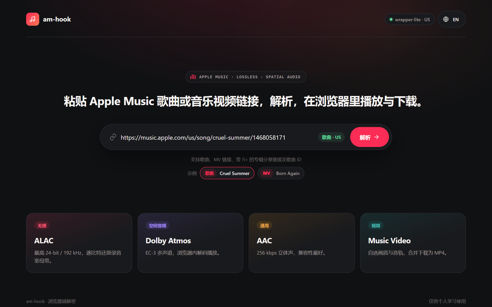

# am-hook

中文 | [English](README.md)

一个用 Rust 编写的 Apple Music 解密工具，支持歌曲（FairPlay HLS）和 MV（PlayReady HLS）。

默认模式下，**解密完全在浏览器中完成**：服务端只与 wrapper-lite 通信（master 播放列表、解密模板、许可证），媒体数据由浏览器直接从 Apple CDN 获取，并在 Web Worker 中用 WebAssembly 解密，不消耗服务器流量。需要给 VLC、IDM 等外部工具提供歌曲解密地址时，可以用 `--hook` 开启服务端解密代理。



## 快速开始

```sh
cargo build --release

# 默认：浏览器端解密，服务端只提供播放列表、解密模板与许可证
am-hook --listen 0.0.0.0:8888 --wrapper-url http://127.0.0.1:12340

# 同时开启服务端歌曲解密代理（VLC / IDM 等外部工具使用，消耗服务器流量）
am-hook --listen 0.0.0.0:8888 --wrapper-url http://127.0.0.1:12340 --hook
```

浏览器打开 `http://127.0.0.1:8888/` 粘贴链接即可。也可以把 Apple Music 链接直接拼在服务地址后面打开对应页面：

| 首页输入 | 打开的页面 |
|---|---|
| `https://music.apple.com/cn/song/<slug>/<id>` | `/https://music.apple.com/cn/song/<slug>/<id>` |
| `https://music.apple.com/cn/album/<slug>/<albumId>?i=<id>` | `/https://music.apple.com/cn/song/<slug>/<id>` |
| 纯数字歌曲 ID，如 `1468058171` | `/https://music.apple.com/us/song/_/1468058171` |
| `https://music.apple.com/cn/music-video/<slug>/<id>` | `/https://music.apple.com/cn/music-video/<slug>/<id>` |

例如：`http://127.0.0.1:8888/https://music.apple.com/cn/music-video/super-bowl-lix-halftime-show-live/1836358807`。链接中的国家代码决定获取展示信息时使用的地区。

### 环境要求

- Rust 2021 edition 工具链
- 运行中的 wrapper-lite 密钥服务（默认 `http://127.0.0.1:12340`）
- 支持 Web Worker 和 WebAssembly 的现代浏览器。播放使用 MediaSource（EC-3 PCM 回退使用 Web Audio）；MV 下载需要 OPFS。

> OPFS 只在安全上下文中可用，也就是 HTTPS 或 `localhost` / `127.0.0.1`。通过 `http://<局域网 IP>` 访问时，歌曲下载退回内存 Blob（大文件占用较多内存），MV 无法下载；播放不受影响。

## Web 界面

- 界面支持中文 / English，右上角按钮一键切换（会记住选择；首次访问按浏览器语言决定）。切换时正在进行的播放和下载不受影响。
- 首页显示 wrapper-lite 状态，以及最近打开的歌曲和 MV。

### 歌曲

- 自动解析全部音质（无损 ALAC / 杜比全景声 / AAC / HE-AAC，含双耳、缩混版本），显示封面、歌名等信息（由浏览器直接请求 iTunes Lookup）。
- 每个音质的「更多」菜单：
  - **下载解密文件**：在浏览器内解密，显示进度，可随时取消。
  - 仅 `--hook` 模式：通过服务器下载；**外部播放器**宫格（VLC、PotPlayer、mpv、IINA、Infuse、nPlayer、MX Player 等 14 款，链接协议与 OpenList 相同），用服务端解密的 media m3u8 播放任意音质，当前平台可用的排在前面；**复制地址**，可选 M3U8（播放器用）或 media file（IDM 等下载工具用）。播放器需已安装并注册链接协议，例如桌面版 VLC 默认不注册 `vlc://`。
  - 页面顶部的「外部播放」按钮直接打开最高音质的外部播放器宫格。
- 内置播放器：MSE 加浏览器端解密。浏览器不支持 ALAC 时通过 FLAC-in-MP4 无损播放；EC-3 的 MSE 不可用时回退为多声道 PCM，并提示空间音频限制。下载保留原始编码；`--hook` 模式下其他编码可走原生 HLS 或直连 media file。支持空格 / 方向键和系统媒体控制。
- 歌词：歌曲有歌词时，播放条上出现「歌词」按钮。歌词视图来自 am-ttml：逐词 / 逐行高亮、和声、对唱、翻译与发音、间奏圆点，点击任意一行即可跳转。背景由专辑封面生成流动效果，Esc 收起。

### MV

- 视频、音频规格分列显示，默认选择最高码率视频和其音频组中的默认音轨；切换视频会更新推荐音轨，也可手动选择音频。
- 播放使用 MediaSource，支持进度跳转和有限缓冲。不支持的编码仍可下载；可选择 AVC/AAC 轨道获得更好的播放兼容性。
- 视频内独立的 CEA-608 字幕轨由前端解码为浏览器原生字幕，默认显示首条字幕，可通过视频字幕菜单切换或关闭。
- 下载逐段解密、按时间交错写入 OPFS，不在内存中拼接整部 MV，输出 fragmented MP4（不进行 defrag、转码或写 tag）。完成后自动触发保存，也可点击「保存 MP4」；取消或失败会清理临时文件，离开页面时尝试清理已完成文件。浏览器崩溃可能留下 OPFS 文件，可通过清理站点数据删除。

## 工作原理

### 歌曲：浏览器端解密（默认）

浏览器端流程（`src/ui/decrypt.js`）：

1. 直接从 `aod.itunes.apple.com` 获取 media m3u8（CDN 允许跨域和 Range 请求），解析出 init 段、各分片的字节范围，以及每个分片对应的 key。
2. 首个分片使用内嵌在 wasm 中的固定模板（`skd://itunes.apple.com/P000000000/s1/e1`），其余分片使用经 `/key` 获取的轨道模板。
3. 分片用 Range 请求拉取，交给 Worker 池（每个 Worker 一个 `hook.wasm` 实例）原地解密；解密逻辑与服务端共用 `crates/am-mp4`，产物与 `--hook` 模式逐字节一致。
4. **播放**：浏览器支持原编码时，解密后的分片直接喂给 MSE。不支持 ALAC 但支持 FLAC-in-MP4 时，按需加载 `flac.wasm`，把 ALAC packet 无损转成 FLAC frame 并重新封装成较小的 fMP4 fragment。EC-3 在 MSE 支持时直接播放，否则按需加载 `ec3.wasm`，通过 Web Audio 播放 5.1/7.1 声道 PCM（不渲染 Atmos 对象）。拖动时直接定位到对应原始分片。
5. **下载**：4 路并发拉取和解密，结果按原始偏移写入 OPFS 临时文件，完成后交给浏览器保存。不支持 OPFS 时退回内存 Blob。

浏览器 `hook.wasm` 和服务端 `--hook` 都会在解密后修复可确认的 ALAC 包尾错误（如歌曲 `1691044818`）：根据 init 中的轨道与 sample description，定位 PCM 完整的未压缩单声道／立体声包，将缺失或损坏的 3-bit `TYPE_END` 恢复为 `111`。修复不改变 PCM、sample 长度或 Range 偏移。压缩包、PCM 截断及没有足够尾部空间的包不做原地修复；转 FLAC 时仍保留可追加结束标记的兜底。

### 歌曲：服务端解密代理（`--hook`）

以 `--hook` 启动后，额外提供以下代理地址（未开启时返回 404）：

```
http://<host>:8888/https://aod.itunes.apple.com/itunes-assets/...
```

这是一种 **URL 前缀式代理**（与 cors-anywhere 类似）：客户端把 CDN 地址直接拼在 am-hook 地址后面，am-hook 代为请求、解密后返回。它只是一个普通的 HTTP 地址，不需要在系统或播放器里配置代理，所以可以直接交给 VLC、IDM 等工具使用。

只处理包含 `aod.itunes.apple.com/itunes-assets/` 的源地址，按文件名特征分类：

| 类型 | 文件名特征 | 行为 |
|---|---|---|
| Master m3u8 | `P<数字>_<非A开头>.m3u8` | 原样转发 |
| Media m3u8 | `P<数字>_A<数字>_...m3u8` | 提取元数据，剥离 `#EXT-X-KEY` 行。默认改写为通用播放列表（`EXT-X-VERSION:3`，无 `EXT-X-MAP` / `EXT-X-BYTERANGE`，每段独立 URL），兼容 PotPlayer 等对 fMP4 BYTERANGE 支持不完整的播放器；加 `?hook=byterange` 可保留 Apple 原始写法 |
| Media file | media m3u8 的 `.m3u8` 替换为 `_m.mp4` | 按范围拉取分片，原地解密 sample，替换加密元数据 box，流式返回 |
| Media segment | media file 的 `_m.mp4` 替换为 `_m_seg<N>.mp4` | init 段 + 第 N 个分片，可单独解码（支持 Range） |

流程：

1. media m3u8 请求建立轨道上下文，包含 `adamId`、`skd://` URI、`fileuri`、首个分片范围和全部分片字节范围。
2. 上下文补齐后，后台监控立即向 wrapper-lite 获取该轨道的解密模板。
3. media file 请求将 HTTP Range 映射到分片，只拉取所需字节；最多 `--prefetch` 个分片并发下载，在阻塞线程上用 temari 线程池并行解密，按顺序流式输出。同一分片的并发请求只下载解密一次，结果进入按字节计量的 LRU 缓存。客户端断开时，未完成的拉取随之取消。

两种模式共用的 box 处理：FairPlay 元数据 box（`sinf`、`senc`、`saiz`、`saio`、`pssh`，以及分组类型为 `seig`/`seam` 的 `sgpd`、`sbgp`）替换为等长的 `free` box，字节长度和 Range 偏移保持不变。init 段中的 `enca` box 改写为原始编码（`ec-3`、`mp4a`、`alac` 等）。

### MV

- `/parse/mv/<adamId>` 从 wrapper-lite `/webplayback` 获取 master 地址，再以 `User-Agent: AM` 获取内容，返回播放列表文本和最终 CDN 地址。
- `/mv/webplayback/<adamId>` 和 `/mv/license` 分别转发到 wrapper-lite `/webplayback` 和 `/license`（只使用 PlayReady；许可证失败会显示错误，不切换其他 DRM）。
- 展示信息（iTunes Lookup）、音视频轨道 m3u8 和分片均由浏览器直连 Apple 获取。
- challenge 构建、license 解析、CENC/CBCS 解密和 fragmented MP4 合并在 Worker 中由 `mv-core.wasm` 完成（Go 实现，见 [browser/mvcore](browser/mvcore/README.md)）。`--hook` 不提供 MV 资源代理。
- 暂不支持直播、discontinuity 或中途更换初始化段的清单。

## 服务端接口

| 接口 | 说明 |
|---|---|
| `GET /` | 首页 |
| `GET /https://music.apple.com/<cc>/song/<slug>/<id>` | 歌曲页 |
| `GET /https://music.apple.com/<cc>/music-video/<slug>/<id>` | MV 页 |
| `GET /status` | wrapper-lite 状态与可用地区 |
| `GET /parse/song/<adamId>` | 通过 wrapper-lite 获取歌曲 master m3u8，返回各音质变体 |
| `GET /key?adamId=<adamId>&uri=<skd-uri>` | 转发 wrapper-lite `/key` 返回的歌曲轨道解密模板 JSON |
| `GET /lyrics/<adamId>` | 通过 wrapper-lite `/lyrics` 获取 TTML 歌词，原样返回 XML；没有歌词时返回 404 |
| `GET /parse/mv/<adamId>` | MV master 播放列表文本与最终 CDN 地址 |
| `GET /mv/webplayback/<adamId>`、`POST /mv/license` | MV 转发到 wrapper-lite `/webplayback` 与 `/license` |
| `/assets/...` | 内嵌在二进制中的页面、脚本与按需加载的 WASM（`no-cache` + ETag） |
| `/https://aod.itunes.apple.com/itunes-assets/...` | 仅 `--hook`：歌曲解密代理 |

## 命令行参数

| 参数 | 默认值 | 说明 |
|---|---|---|
| `-l, --listen <ADDR>` | `0.0.0.0:8888` | 监听地址 |
| `-p, --port <PORT>` | 可选 | 设置时覆盖 `--listen` 中的端口 |
| `-w, --wrapper-url <URL>` | `http://127.0.0.1:12340` | wrapper-lite 密钥服务地址 |
| `--hook` | 关闭 | 开启服务端歌曲解密代理 |
| `--cache-ttl <SECONDS>` | `1800` | `--hook`：轨道上下文 TTL 淘汰时间 |
| `--lru-cache-mb <MB>` | `128` | `--hook`：已解密分片的内存 LRU 缓存容量（按字节计） |
| `--prefetch <N>` | `4` | `--hook`：单个请求内并发拉取 / 解密的分片数 |
| `--template-timeout <SECONDS>` | `20` | `--hook`：等待轨道解密模板的超时时间 |

## 构建

```sh
cargo build --release
```

二进制位于 `target/release/am-hook`（Windows 下为 `am-hook.exe`）。浏览器端资源（包括预编译的 WASM）都提交在 `src/ui/` 下并内嵌进二进制，普通构建只需要 Rust。只有修改对应源码后才需要重新生成：

| 产物 | 源码 | 重新生成 |
|---|---|---|
| `hook.wasm`、`flac.wasm` | `crates/am-wasm`、`crates/am-flac-wasm`（及 `am-mp4`、`am-alac`、`temari`） | `rustup target add wasm32-unknown-unknown` 后运行 `scripts/build-wasm.sh` |
| `mv-core.wasm`、`mv-go.js` | `browser/mvcore` | `python scripts/build-mv-wasm.py`（Go 1.22+） |
| `mv-cea608.mjs` | `browser/cea608` | `node scripts/build-cea608.cjs <typescript 包路径>` |
| `ec3.wasm`、`ec3-runtime.mjs` | `@mediabunny/ac3` 1.59.1 | `node scripts/extract-ec3.mjs`，见 [EC3-SOURCE.md](src/ui/EC3-SOURCE.md) |

## 测试

```sh
cargo test --workspace
```

单元测试覆盖 URL 解析、m3u8 改写、MP4 box 修补（含 wasm 原地解密路径与并行路径结果一致）、Range 解析、缓存去重和 MV 接口。端到端测试连接真实 CDN 与 wrapper-lite（默认 `http://127.0.0.1:12340`，可用环境变量 `AM_HOOK_WRAPPER` 覆盖），验证解密后的分片、跨分片 Range，以及未开启 `--hook` 时代理请求被拒绝。

浏览器端测试是普通的 Node 脚本：

| 类型 | 命令 |
|---|---|
| 离线，仅需 Node | `node --test tests/player_*.cjs`、`node tests/mv_hls.cjs`、`node tests/mv_captions.cjs` |
| 离线，Playwright + Chrome 与本地 fixture | `node tests/ui_layout.cjs <playwright>`、`node tests/lyrics_ui.cjs <playwright>`、`node tests/mv_ui.cjs <playwright>` |
| 在线（需运行 am-hook、wrapper-lite 并能访问 Apple CDN） | `node tests/mv_live.cjs <playwright> [base]`、`node tests/mv_captions_live.cjs <playwright> [base]`、`node tests/alac_recovery.cjs <playwright>`、`node tests/alac_source_recovery.cjs <playwright>`（需 `--hook`） |

`<playwright>` 为 Playwright 包路径；在线测试默认地址为 `http://127.0.0.1:18888`（MV）或 `AM_HOOK_URL` / `http://127.0.0.1:8888`（ALAC）。

## 项目结构

```
src/
  cli.rs               命令行参数解析
  main.rs              服务启动
  lib.rs               路由构建
  source.rs            源地址规整与类型识别
  proxy.rs             fallback：歌曲 / MV 页面、--hook 请求分流、Range 流式响应、分片调度
  m3u8.rs              Apple Music 链接解析、HLS 播放列表解析和加密标记剥离
  state.rs             轨道上下文（并发去重）和分片缓存
  wrapper.rs           wrapper-lite 请求客户端（master m3u8、解密模板）
  monitor.rs           --hook：后台模板拉取和 TTL 清理
  ui.rs                Web 接口（状态、解析、模板、歌词、MV 转发、静态资源）
  ui/
    home.html / song.html / mv.html / app.css / mv.css   页面与样式
    i18n.js            中英文文案
    player.js          歌曲播放器（MSE）
    decrypt.js         歌曲解密：m3u8 解析、Worker 池、模板、下载与 OPFS
    hook-worker.js     Worker：调用 wasm 解密、写入 OPFS
    hook.wasm          crates/am-wasm 的编译产物
    flac.wasm / flac-transcode-worker.js / flac-init.bin   ALAC 转 FLAC 播放
    ec3.wasm / ec3-runtime.mjs / ec3-decode-worker.js      EC-3 PCM 回退
    lyrics/            歌词界面（来自 am-ttml 的 ES module；panel.mjs 接入播放器）
    mv-page.mjs        MV 页面逻辑
    mv-hls.mjs / mv-engine.mjs / mv-worker.js             MV 清单解析、播放、下载与 Worker
    mv-core.wasm / mv-go.js                               browser/mvcore 的编译产物
    mv-captions.mjs / mv-cea608.mjs                       CEA-608 字幕
crates/
  am-mp4/              ISOBMFF 解析、box 修补、sample 解密（服务端与 wasm 共用）；内嵌首段固定模板
  am-alac/             保守的 ALAC 包尾修复
  am-wasm/             am-mp4 的浏览器端 C ABI 导出（wasm32-unknown-unknown）
  am-flac-wasm/        浏览器端 ALAC 解码与 FLAC frame 写入
  temari/              内置的 Temari FairPlay 解密库
browser/
  mvcore/              MV 核心的 Go 源码（PlayReady、CENC/CBCS、MP4 合并）
  cea608/              来自 hls.js 的 CEA-608 解析器
scripts/               WASM / 资源构建脚本
tests/                 Rust 集成测试与 Node 浏览器测试
```
